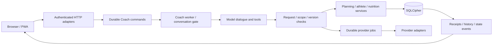

# Intervals Coach: architecture and Coach-first review

Review date: 2026-09-27. Remediation handoff for GPT-6 Luna.

## Scope and verdict

Reviewed commit: `f3eacc3bb79c99aa2f346cb872412637cfa90fb1` on
`t3code/coach-first-code-review`. The worktree was clean before review. This is a
whole-repository review, not a PR-diff review. No application fixes were made.
This report is the only intended source-tree addition.

The application has substantial domain extraction and a sensible deployment
foundation. Python, SQLCipher, a single application process, durable local jobs,
and a small PWA remain appropriate for one athlete. A framework rewrite,
microservices, a broker, or a different database are not justified by this review.

The Coach is **not yet demonstrated to be a reliable complete primary interface**.
Its tool coverage is broad, but authorization relies on model-generated claims,
remote completion wording can contradict durable job state, conflict adoption
damages provider identity, and nutrition lacks API/Coach parity. Normal workout
synchronization also loses concurrent local edits from its pending-work tracking.

The main architectural weakness is inconsistent contracts between otherwise
separated modules. Several confirmed defects occur where untyped dictionaries
change meaning across boundaries. Additional file splitting alone will not fix
this. Structure, placement, technology, performance, and test strategy receive
their own work packages below and must not be treated as an appendix to Coach work.

Applied instructions: root, public, and tests AGENTS.md; full codebase-review,
navigator, and minimal-solution skills. The user subsequently authorized this
Markdown artifact. Secrets, `.env`, live data, Garmin tokens, backups, and runtime
logs were excluded. No real provider or model calls were made.

## Findings and required repair tasks

Priorities: P1 = high; P2 = medium; P3 = low. Confidence describes the evidence,
not the likelihood that a real model or athlete will encounter the trigger.

### F1 — P1: Stop treating an executing model's request metadata as independent authorization

Anchors: `backend/coach/dialogue_action.py:54`, especially construction of the
action around line 87; `backend/coach/authorization.py:75`;
`backend/coach/structured_turn.py:90`.

**Evidence and trigger.** Normal chat exposes mutable tools. A mutable tool call
supplies its own `_request`, including user-message IDs, scope, target, and
`remote_write`. Validation checks provenance, live IDs, and structural consistency,
but the authority claim comes from the same model output requesting the effect.
Referencing a genuine current user message does not establish that it authorized
the action. The prompt instructs the model correctly; this is an enforcement gap.

Using the real local dialogue loop, temporary storage, and mocked model output:

- User: `Do not save anything; only explain what a daily check-in is.`
- Mocked model: `save_checkin` with a structurally valid current-message request.
- Result: the write succeeded and the turn completed.
- User: `Do not synchronize. Only explain how synchronization works.`
- Mocked model: `start_intervals_plan_sync` with `remote_write=true` and
  `all_pending` scope.
- Result: a `plan_push` job was queued.

No provider write ran. This demonstrates what happens **if the model misinterprets
the request or follows injected content**; it does not measure real model attack
success or claim that the tested production model naturally generated these calls.

**Impact.** A model error can cross from advice into durable writes and remote-write
queueing. Existing object/hash checks constrain the chosen object but do not prove
the athlete chose the effect. The same distinction matters for later-turn adaptive
approval: being a later message is not itself semantic approval.

**Tasks for Luna.**

1. Trace `_request` from schema through preparation, authorization, execution,
   replay, and receipt persistence. Document separately: provenance, request
   interpretation, authorization scope, and effect preconditions.
2. Define a server-owned accepted-request contract. An executing tool call must
   consume its scope and preconditions, not mint or broaden its own permission.
   Bind it to user/turn/session, operation family, concrete targets or bounded
   period, local/remote effects, expiry, and cancellation state as applicable.
3. Preserve direct execution of clear authorized local requests and natural
   follow-ups. Do not introduce a verb list, exact-name router, or blanket
   confirmation dialog for every local action.
4. Reuse the existing proposal/approval mechanism for effects that require an
   independent explicit approval boundary, particularly destructive provider
   actions and adaptive apply. Do not create a second parallel proposal system.
5. Specify the remaining semantic trust honestly. A server-owned envelope alone
   does not make an LLM's interpretation infallible; a second unconstrained model
   classifier is not a proof of consent. If stronger protection changes the
   interaction contract, present that specific tradeoff before implementing it.
6. Reject execution that expands an accepted local request into remote work or
   changes its target set. Revocation and stale approval must fail closed.

**Acceptance checks.** Preserve successful explicit requests and contextual
acceptance. Add adversarial execution tests for negation, hypothetical advice,
quoted instructions, provider text, a forged broad scope, wrong-session approval,
cancelled requests, and adaptive rejection after publication. Verify the database
and queue contain no extra effects. Separately evaluate language interpretation
with synthetic dialogues; do not count canned tool calls as language accuracy.

**Watch for:** solving provenance only; adding more prompt text and calling the
boundary enforced; making every useful action require repeated confirmation;
silently changing the special remote-sync contract. Confidence: high for the
execution gap; real-model occurrence rate unmeasured.

### F2 — P1: Preserve local changes made while a workout upload is in flight

Anchors: `backend/sync/planned_calendar.py:239` and
`backend/sync/reconcile.py:52` (`PlannedUnitSyncStateWriter.persist`).

**Evidence and trigger.** Normal sync loads a workout, sends it, then persists
`synced`. The state writer rereads the latest local payload, copies remote fields
into it, clears dirty state, and hashes that latest payload. It never verifies
that the local record still matches the version uploaded.

Reproduced with a fake provider that edits the local workout during upload:

```text
Uploaded duration: 2100 seconds (35 minutes)
Concurrent local edit: duration_minutes = 50
Persisted after response: duration_minutes = 50, moving_time = 2100
Persisted flags: sync_state = synced, sync_dirty = 0
```

The updated workout is absent from pending work although the provider received
the old one. Entry-level sync serialization does not serialize local editing.
Initial manifest hash checks occur too early to close this race.

**Tasks for Luna.**

1. Capture the exact revision/hash and normalized payload being sent before I/O.
2. After I/O, use a conditional update against that captured version. Put the
   comparison and persistence in one database transaction.
3. If local content changed, preserve it and leave it pending/conflicted. Retain
   any newly established remote identity without overwriting newer local fields.
4. Define what the baseline represents: the confirmed remote version, never a
   newer version the provider has not received.
5. Apply this invariant to normal success and error persistence. Inspect archive,
   deletion, recreation, and missing-row cases as well as ordinary editing.
6. Reuse the repair path's useful concurrency protections, but do not route every
   normal upload through a costly full remote repair.

**Acceptance checks.** Extend `tests/test_sync_planned_calendar.py` with deterministic
provider callbacks/barriers: edit, archive, delete, and reschedule between request
and response. Confirm newer data remains intact and pending, remote identity is
recoverable, and retry uploads the newer content exactly once. Existing repair,
selected-manifest, and per-ID serialization tests must remain green.

**Watch for:** holding the database writer lock across network I/O; only checking
before the request; acknowledging a newer hash; dropping a successful create's
remote ID when rejecting a stale response. Confidence: high, reproduced.

### F3 — P2: Preserve provider identity when adopting a remote conflict

Anchors: `backend/planning/planned_unit_service.py:317`,
`backend/sync/planned_units.py:164`, `backend/planning/planned_units.py:250`.

**Evidence and trigger.** Reconciliation stores an already normalized local
representation in `sync_conflict.remote`. It contains a generated local `id` and
the actual `remote_event_id`. Conflict adoption passes that representation back
through the raw-provider normalizer, which reads `event.id` as the provider ID.

Reproduction: import provider event `provider-123`; edit locally; reconcile a
different provider edit; choose `adopt_remote`. The saved `remote_event_id` becomes
a generated UUID instead of `provider-123`. The local record is marked synced.
An immediate subsequent push builds its provider `id` from that incorrect value.
A later read refresh can repair the link through external identity; that recovery
does not make the accepted state correct. Duplication was not reproduced.

**Tasks for Luna.**

1. Choose one explicit conflict representation: raw provider event or normalized
   domain snapshot. Keep the producer and consumer consistent.
2. Normalize exactly once. Preserve local identity, provider identity, external
   identity, and local-only plan metadata according to their separate ownership.
3. Introduce small named types at this boundary so a normalized snapshot cannot
   accidentally be passed as a raw event again. A TypedDict/dataclass is enough.
4. Compute the baseline from the adopted provider-owned content and clear the
   conflict atomically with the corrected payload.
5. Inspect `keep_local`, remote-deletion adoption, and stale conflict selection
   for equivalent identity/metadata mistakes without broadening this patch.

**Acceptance checks.** Add a full import -> local edit -> remote edit -> conflict
-> adopt -> immediate provider-payload test. Assert actual provider ID and local
ID separately. Include missing external ID, unchanged remote event, local plan
metadata, deletion, and rollback. The existing service test supplies a raw event
and therefore misses the production producer/consumer mismatch.

**Watch for:** fixing only the test fixture; adding compatibility fallbacks for
multiple conflict shapes; accepting a malformed or stale object silently.
Confidence: high, reproduced.

### F4 — P2: Derive completion claims from job outcomes, not successful queue insertion

Anchor: `backend/coach/turn_outcome.py:66`; supporting path
`backend/sync/plan_commands.py:63` and `backend/coach/final_receipt.py`.

**Evidence and trigger.** A sync tool returns `ok=true, status=queued`. If the
model supplies a final success sentence, finalization preserves it because no
tool failure occurred. Reproduced with an explicitly authorized sync request:

```text
Persisted assistant message: Synchronized successfully.
Durable job: plan_push / queued
```

The structured job information is truthful. It does not prevent contradictory
assistant text from being persisted and shown. This is independent of F1.

**Tasks for Luna.**

1. Separate request/turn completion, committed local effects, queued provider
   effects, and confirmed remote effects in the result contract.
2. Produce the authoritative action-status statement deterministically from
   receipts and terminal job observations. Model prose may explain training;
   it must not be the authoritative success signal for pending effects.
3. For an async result, report queued/running with job linkage. For requests that
   require a completed refresh before advice, observe the existing job through
   the bounded wait/recovery path before calling the data current.
4. Preserve partial failures and cancellation-after-local-commit accurately.
   Reload and follow-up views must derive from the same durable outcome.
5. Avoid scanning generated prose for words such as "success"; enforce structured
   outcome semantics and render the factual action result from them.

**Acceptance checks.** Queued, running, completed, partial, failed, cancelled,
timeout, and local-success/follow-up-failure outcomes. Deliberately supply false
model completion text and verify it cannot become the authoritative receipt or
unqualified completion answer. Test eventual UI/history reconciliation when Docker
is available. Confidence: high, reproduced with mocked model output.

### F5 — P2: Expose nutrition correction and explicit sync through the Coach

Anchors: `backend/coach/tools.py:258`,
`backend/coach/athlete_record_tools.py:122`, `backend/http_api/nutrition.py`.

**Evidence and trigger.** The API supports updating a meal and explicitly syncing
a date or pending dates. Coach tools provide read, create, and delete only.
`save_nutrition_entry` always inserts through `log_meal`; it cannot update an
existing entry. There is no nutrition-sync tool. "Correct that lunch to 600 kcal"
cannot use the existing update operation, and "sync today's nutrition" cannot
reach the supported sync operation. Delete/recreate is not an identity-preserving
correction and is an unnecessary destructive workaround.

**Tasks for Luna.**

1. Add a focused correction tool or explicit update variant using the existing
   nutrition service. Resolve the entry through a prior read and preserve its ID.
2. Define partial correction semantics deliberately: the HTTP update currently
   normalizes a full record. A calories-only correction must preserve date, time,
   description, macros, and provenance rather than defaulting omitted fields.
3. Add explicitly authorized nutrition synchronization, including date/pending
   selection and truthful result reporting. Reuse durable provider-job machinery
   where required for retries and observation; do not add implicit remote sync on
   meal creation or correction.
4. Wire schema, active inventory, scope validation, dispatch, receipt/history,
   context/UI refresh, and executable tool coverage together.
5. Include edits moved between dates: both the old and new date may need resync.

**Acceptance checks.** Read -> identify -> correct -> reread preserves identity
and untouched fields. Ambiguous meals require a meaningful clarification. Test
stale/missing IDs, invalid numbers, duplicate delivery, rollback, explicitly
requested sync, denied remote sync, zero totals, and retry after partial failure.
Confidence: high for missing parity, established from schema and dispatch.

### F6 — P2: Send explicit macro clears when resynchronizing zero totals

Anchor: `backend/nutrition/sync.py:48`.

**Evidence and trigger.** The service always sends calories, but sends each macro
only when its total is greater than zero. After deleting the last meal or changing
a previous macro total to zero, the outgoing payload contains no macro clears.
The service can nevertheless mark the date synced and report zero macros in its
summary. Under the wellness API's field-update semantics, previous provider macro
values remain. No connected provider test was run; the omission itself was
reproduced with a fake client:

```json
{"id":"2026-09-21","kcalConsumed":0}
```

**Additional confirmed result-reporting defect.** At
`backend/nutrition/sync.py:92`, `sync_pending` discards the result of `sync_day`
and appends the date to `synced_dates`. A mocked concurrent revision change made
`mark_date_synced` return false: the individual result correctly said
`pending=true`, but the batch still returned `ok=true` and included the date in
`synced_dates`. The local pending revision is preserved; the batch report is
misleading. This observation does not depend on the live provider's macro-update
semantics. Preserve the individual pending result in the batch response and test
that it cannot be represented as a fully synchronized date.

**Tasks for Luna.**

1. Verify the current provider contract for zero versus null versus omitted macro
   fields using public documentation or an approved disposable test target.
2. Send an explicit zero/clear for fields this application owns when their known
   total becomes zero. Do not overwrite unrelated wellness fields.
3. Distinguish unknown macro input from a known zero if the domain needs that
   distinction; the existing aggregate currently collapses these cases.
4. Retain the revision check in `mark_date_synced`. Inspect `sync_pending` too:
   it currently lists a date as synced without propagating `sync_day.pending`.
   Preserve pending status when a concurrent edit wins.

**Acceptance checks.** Fake a provider with merge/update semantics. Sync nonzero
values, delete/correct to zero, sync again, and assert provider values are cleared.
Repeat with a concurrent edit and partial batch failure. Confidence: high for
outgoing omission; medium for live-provider manifestation until contract verified.

### F7 — P2: Remove full snapshot decoding from lightweight state-version polling

Anchor: `backend/http_api/state_versions.py:31`; callers
`backend/sync/status.py:176` and `backend/http_api/bootstrap_state.py:64`.

**Evidence.** `versions()` loads/deserializes the latest full provider snapshot
only to read its timestamp and recent-activity count. Active browser polling runs
every 1.5 seconds. Bootstrap loads the snapshot itself, calls versions, then calls
`browser_state`, which obtains versions again before removing them from its result.
Bootstrap does this while holding the shared database lock/writer unit of work.

Isolated native SQLite benchmark, eight calls per case:

| Synthetic serialized snapshot | Median versions() time |
| --- | ---: |
| 76 bytes | 0.18 ms |
| 10,308,964 bytes | 160.41 ms |

This isolates size-dependent JSON work, not a production latency estimate. The
synthetic raw content is not representative athlete data. SQLCipher, Docker,
concurrent workload, and production hardware were not measured.

**Tasks for Luna.**

1. Persist small version metadata atomically with the snapshot, or expose an
   equivalent scalar repository projection that does not decode the full blob.
2. Reuse already obtained markers inside one bootstrap projection. Avoid deriving
   data only to discard it in `browser_state`.
3. Preserve freshness, rollback, restore, and same-build restart semantics. Do not
   truncate authoritative snapshots or cache markers without invalidation.
4. Review other expensive read projections held under the writer lock. Move pure
   projection work outside the critical section after obtaining a consistent
   immutable snapshot, where that is simpler and correct.

**Acceptance checks.** Prove metadata changes on successful snapshot commit,
stays unchanged on rollback, and is correct after restore. Assert the marker path
does not invoke full snapshot decoding. Repeat the size benchmark and report
measurements, avoiding flaky wall-clock thresholds in unit tests.
Confidence: high, measured and traced.

### F8 — P3: Correct database and recovery documentation

Anchors: `README.md:452`, `README.md:458`, and `README.md:372`.

The README names `/data/coach.db`, a fixed
`/data/backups/pre_restore_backup.db`, and a `background_jobs` table. Current
implementation uses `intervals-coach.db`, generated adjacent pre-restore recovery
filenames, and separate `coach_commands`/`sync_jobs`. The recovery-path mismatch
can misdirect an athlete looking for the safety copy after restore trouble.

**Tasks.** Read current config/restore/job-store code; update exact paths and
architecture description; explain the naming pattern without instructing users
to remove or replace data manually. Keep examples consistent with the implemented
validated restore flow. Verify documentation against source, never real backups.
Confidence: high, static. No new test is needed for a prose-only correction.

## Architecture, placement, and technology assessment

### Current shape

Inventory: 715 tracked files; 310 backend Python modules containing approximately
51,792 lines; 38 assembly modules; 68 Coach modules; 55 sync modules; 52 HTTP API
modules. `server.py` is 1,830 lines and is predominantly composition. `public/app.js`
is 5,261 lines. These counts are orientation, not quality scores or reduction goals.



That direction is appropriate. Improve contract ownership along it. Do not add
another generic framework around the whole chain.

### Technology decisions

| Choice | Assessment | Recommended decision |
| --- | --- | --- |
| Python 3.14 | Appropriate for I/O-heavy single-athlete use and current dependency/toolchain contract | Keep; validate in pinned Linux container as well as native isolated tests |
| SQLCipher + SQL repositories | Fits durable private local state and transactional writes | Keep; typed boundaries and disciplined transactions matter more than introducing an ORM |
| One process and durable SQLite jobs | Appropriate operating complexity for one athlete | Keep; unify job semantics and repair idempotency; no Redis/Celery requirement |
| `http.server` / threaded HTTP | Viable within the mandated trusted-LAN/VPN boundary; application owns parsing, auth, SSE, and resource limits | Keep for these repairs; measure concurrency and standardize transport contracts before considering a framework |
| Vanilla JavaScript PWA | Small runtime dependency footprint is useful; shared global state is now the maintenance bottleneck | Extract cohesive modules/state ownership; a React rewrite is not justified |
| Custom restricted Markdown | Escaping and HTTP(S)-only links reduce exposure; limited dialect can be acceptable | Keep if its supported subset is intentional and tested; do not replace it with raw HTML rendering |
| Custom provider HTTP/SSE adapters | Offers explicit redaction, bounds, cancellation; duplicates protocol maintenance work | Keep working boundaries; evaluate an official SDK only against concrete simplification and security requirements |
| OpenAI Responses support | Real feature with history/media/stream complexity, not dead code | Keep provider normalization out of domain authorization and persistence policy |
| JSON payloads plus scalar state columns | Flexible provider snapshots; weaker contracts for mutable domain entities | Keep full raw snapshots; type normalized records and make duplicate-state invariants explicit |
| Fresh-schema-only installation | Explicit product contract | No migration/legacy compatibility layers; current-schema restore and same-build restart still must work |
| Docker canonical runtime | Correct response to SQLCipher's unavailable native Windows wheel | Keep secure-startup failure; never substitute plaintext SQLite in the app to get a browser running |

### A1 — High value: make raw, normalized, persisted, and public contracts distinct

F3 is a concrete example of identical-looking dictionaries meaning different things.
There are about 3,709 AST references to `Any` across backend modules. Not every one
is a problem; provider ingress is legitimately dynamic. The risk is `Any` crossing
validated internal boundaries without narrowing.

**Work package:** start at planned-unit identity, sync acknowledgements, accepted
Coach requests, and receipt outcomes. Use standard-library dataclasses, TypedDicts,
enums/Literals, and small Protocols where useful. Decode and validate external JSON
once. Do not invent a universal entity framework or convert every dictionary.

**Placement:** provider wire shapes in `providers`; normalized records and invariant
checks with their domain; SQL decoding in repositories; public response projection
in HTTP/read adapters. Do not pass raw provider events to a function expecting a
normalized unit, or expose persistence internals as a public contract by default.

**Done when:** the F3 boundary is unambiguous, affected modules receive meaningful
type checking, and behavior tests cover real producers and consumers together.

### A2 — High value: reduce construction indirection without undoing domain ownership

`CoachTurnAssembly` and `CoachToolDispatchAssembly` carry nested input dataclasses,
many `Callable[[], Any]` dependencies, and factories that repeatedly construct
stateless services. This makes lifetimes and the path to one durable effect harder
to inspect. Some late binding is necessary because database restore replaces the
active manager; blindly constructing everything once would be wrong.

**Work package:** document stable singleton, manager-bound, per-operation, and
transient dependencies. Use concrete injected services for stable objects. Retain
explicit factories only for changing lifetimes. Simplify redundant pass-through
assembly layers as their domain is touched; keep a clear composition root.

**Done when:** a reviewer can follow one request to the transaction owner without
several wrappers whose only job is forwarding another factory. Restore tests prove
no stale DB handles survive. Do not chase a target line count in `server.py`.

### A3 — High value: repair dependency direction and code placement

Concrete examples:

- `backend/planning/state_service.py:11` imports HTTP pagination helpers.
- `backend/providers/intervals_client.py:13` imports planning transformations and
  sync gates; provider and sync packages consequently depend on one another.
- Activities reads import snapshot helpers from sync, while sync imports activity
  deduplication. Performance and activities also have bidirectional package edges.
- Nutrition remote sync lives in `backend/nutrition/sync.py` and is invoked directly
  from HTTP, unlike durable provider-job orchestration elsewhere.

These are package-level dependency cycles, not a claim of failing Python imports.

**Work package:** move generic cursor encoding to a small neutral module or keep
transport cursor concerns in adapters; put snapshot read access behind persistence;
keep provider request/response adaptation in providers and synchronization policy
in sync. Move nutrition sync orchestration with F5 if it joins provider jobs. Keep
cohesive sport/identity rules together instead of scattering tiny helpers.

**Done when:** domain services do not depend on HTTP, providers do not own queue or
planning authority policy, and narrowly scoped import-direction checks prevent
regression. Avoid a vague `utils` dumping ground and mechanical mass moves.

### A4 — High value: use one coherent tool-capability contract

Tool names and policies are distributed across canonical inventory, structured
schemas, dialogue schemas, read-only sets, metadata/preparation, dispatch, outcome
labels, and transaction exclusions. `apply_training_changes` remains canonical
while active dialogue substitutes `apply_training_patch`. Multiple surfaces can be
legitimate, but their distinctions are currently easy to miss when adding a tool.

**Work package:** define a small declarative catalog for stable metadata: tool name,
schema, effect class, owner, authorization needs, and execution/receipt behavior.
Derive simple inventories from it; keep actual business logic in domain services.
Explicitly name tools that exist only for API commands versus active dialogue.
Build on the existing executable tool coverage matrix rather than replacing it.

**Done when:** adding nutrition correction/sync cannot omit a dispatcher, effect
classification, receipt projection, or success-path test without a failing check.
Do not build dynamic plugin discovery or a generic workflow engine.

### A5 — High value: give the frontend state transitions explicit owners

`public/state.js` exposes shared mutable chat, job, sync, route, draft, voice, and
session state. Most rendering and orchestration remain in `public/app.js` despite
separate helper files. Many generation counters and pending flags are reasonable
race defenses, but their relationships are hard to maintain globally.

**Work package:** first extract a cohesive Coach lifecycle owner covering submit,
queue, stream, background polling, cancel, reset, and history reconciliation.
Define which request/session generation may update it. Next extract provider-status
and scoped-load ownership, then view/form controllers as needed. Keep pure render
functions separate from effects. Native JavaScript modules are sufficient.

**Done when:** state transitions have an inspectable owner, stale callbacks cannot
resurrect old state, and existing five-viewport journeys still pass. Update asset
query versions and service-worker assets/cache on every frontend change. Do not
combine this extraction with an unrelated visual redesign.

### A6 — Medium value: make resource bounds and read costs explicit

`DatabaseManager` describes a bounded reader pool, but `reader()` creates another
connection whenever the idle queue is empty. The bound limits retained idle
connections, not concurrent active readers. The threaded HTTP server's accept
backlog is also not an active-thread limit. No production exhaustion was reproduced.

Tool result size also deserves measurement: listing up to 500 library records can
include long descriptions, and nutrition range reads return every matching entry.
The bounded initial Coach context does not automatically bound later tool output.

**Work package:** implement F7 first. Measure representative concurrent status,
bootstrap, SSE, and Coach loads in SQLCipher Docker. Decide whether bounded leases
or request admission are needed. Add bounded summary/pagination/detail contracts
to expensive tool reads without hiding records the Coach must enumerate.

**Done when:** documented bounds match actual behavior; pagination preserves IDs,
revision checks and complete-plan repair; a pool cap cannot deadlock nested reads,
restore drain, or a transaction's reader reuse. Do not shrink authoritative data.

### A7 — High value: shift validation toward behavior and meaningful quality checks

The repository has extensive tests, including real local dialogue-loop tests and
static architecture guards. However, `tests/test_server_architecture.py` contains
over 3,400 lines and many checks about exact symbol placement/construction shape.
These can protect extraction while making harmless simplification expensive.
They did not catch normalized-provider identity being confused across modules.

The CI quality job runs Ruff, formatter, and mypy only on `tests/run_tests.py`;
coverage is collected for one shard with `--fail-under=0`. This is a baseline job,
not application-wide static checking or an enforced coverage standard.

**Work package:** retain architectural invariants such as no backend import of
`server.py`, no HTTP dependency in domains, and explicit transaction ownership.
Replace brittle implementation-shape assertions only when an equivalent behavioral
or boundary check exists. Extend lint/type checks incrementally to repaired modules;
use the existing tools, not additional quality frameworks. Add integration fixtures
that traverse real producer/consumer boundaries and delayed-provider responses.

**Done when:** F2/F3 fail before their fixes; CI checks changed application modules;
coverage reporting is accurately described; deterministic execution tests and actual
language-quality evaluation remain separate evidence categories.

### A8 — Medium value: standardize API errors and asynchronous operation results

`public/api.js` retains a structured `reason`, but generic HTTP `AppError` handlers
usually serialize only `error`; SSE/tool paths have richer outcomes. Nutrition sync
also uses synchronous request execution while other provider work uses durable jobs.
This is inconsistent interface design; no additional independent UI failure is
claimed here beyond the confirmed findings.

**Work package:** define a compact redacted error envelope and async-job result
contract; adapt existing handlers without changing user-visible business rules.
Preserve status, reason, retry timing, object context when safe, and pending versus
terminal status. Use the same domain use case from HTTP and Coach.

**Done when:** validation/conflict/auth/provider failures can be distinguished by
clients; unknown exceptions remain redacted; cancellation and partial success retain
already committed effects; source tests and intercepted browser tests agree.

## Execution plan for GPT-6 Luna

This document is a reviewed backlog, not evidence that a proposed fix is correct.
Before editing, read applicable AGENTS.md and verify the current branch against
the reviewed snapshot. Re-trace changed code; line numbers may have moved.

1. Fix F2 and F3 separately, each with a failing deterministic regression first.
   Apply A1 only at the affected boundaries. These are concrete data-integrity
   defects with narrow repair scope.
2. Specify F1's accepted-request/security contract, then implement and evaluate it.
   Do not conceal unresolved semantic authority behind naming or prompt changes.
3. Fix F4 using explicit local/queued/remote outcome semantics. Coordinate with
   F1/A4 but keep tests for authorization and outcome truthfulness separate.
4. Fix F6 and then F5; unify nutrition's domain operation and Coach/API adapters.
   Correcting or creating a meal must remain local until explicit remote sync.
5. Fix F7 with atomic lightweight metadata and remove redundant projection work.
6. Correct F8. Then perform bounded A2-A8 improvements, one cohesive responsibility
   at a time. Do not make all findings wait for a broad refactor.
7. Run the blocked SQLCipher/browser journeys and the separate semantic evaluation
   before claiming the Coach can handle all operations reliably.

For each implementation task, record: files changed, invariant, before/after
reproduction, focused test result, broader required checks, remaining limitation.
Use Conventional Commits. Work in a dedicated task worktree; preserve primary
checkout and runtime data. This handoff alone does not request publishing,
deployment, real provider writes, or destructive data operations.

Required validation after code changes:

```powershell
python -m unittest discover -s tests -v
python -m compileall -q server.py backend tests
docker build -t ai-coach:local .
```

Use focused `unittest discover -s tests -p 'test_<area>.py' -v` while iterating.
Run affected Playwright projects for browser-facing changes, then the relevant
cross-viewport flows. Use the repository's isolated fixture runtime and fake
providers. Never bypass SQLCipher startup or test against the real installation.

## Coach capability ledger

Status here distinguishes available execution paths from demonstrated natural
language competence. All live semantic model evaluations were not run: no external
model calls were authorized for this review, and repository tests require mocks.

| Capability / tools | Source/execution evidence | Verdict or remaining requirement |
| --- | --- | --- |
| `read_profile`, `update_profile` | Partial changes include expected values; local profile authoritative | Path present; F1 applies; paraphrase/correction evaluation pending |
| `read_training_state`, `list_planned_workouts` | Revision-bound enumeration and local planned reads | Path present; test complete enumeration under concurrent revision changes |
| `list_recent_activities`, `get_activity_details` | Local snapshot and bounded detail projection | Path present; no unconditional provider fetch required |
| `list_workout_library`, `manage_training_templates` | Read and create/update/archive/restore/delete templates | Path present; assess result-size bounds under A6 |
| `list_training_plans`, `update_training_plan` | Metadata read/change distinct from scheduled workouts | Path present; preserve that distinction in explanations |
| `stage_training_plan`, `commit_training_plan` | Local artifact and atomic commit | Path present; draft references and local-only effects covered by execution fixtures |
| `replace_training_plan`, `apply_training_patch` | Period/revision/hash guarded local changes | Path present; actual language understanding and browser reload unverified |
| `apply_training_changes` | Underlying command supported, omitted from active dialogue in favor of patch | Inventory distinction must remain explicit under A4 |
| `apply_workout_library_plan` | Library-to-plan local action | Path present; verify date/scope preservation in full journey |
| `save_checkin` | Local durable athlete observation | F1 reproduced on explicitly read-only prompt |
| `save_activity_feedback`, `delete_activity_feedback` | Completed-activity feedback operations | Path present; referential language evaluation pending |
| `list_competitions`, `save_competition`, `delete_competition` | Local authoritative records and tombstones | Path present; preserve explicit remote boundary |
| `start_provider_refresh`, `refresh_current_performance` | Existing provider job path and named targets | Path present; freshness-before-advice needs actual semantic/journey evidence |
| `start_intervals_plan_sync`, `sync_competitions`, `get_sync_job` | Explicit queue/manifests/job observation | F1, F2, F4; remote completion must be observed |
| `resolve_training_sync_conflict` | Local conflict strategies and failed-job retry | F3; test both data conflict and partial-job recovery |
| `preview_adaptive_replan`, `apply_adaptive_replan` | Published-preview/later-turn and revision checks | Structural boundary present; semantic approval remains within F1 |
| `list_change_history`, `undo_training_change` | Preview/apply and durable history | Path present; do not imply undo also reverts remote effects |
| `inspect_activity_duplicates`, `delete_duplicate_intervals_activity` | Inspection/proposal and separate destructive action | Preserve independent confirmation and exact remote identity |
| `clarify_coach_request`, `cancel_coach_request` | Durable pending question/request state | Path present; contextual replies and cancellation need semantic evaluation |
| `read_nutrition`, `save_nutrition_entry`, `delete_nutrition_entry` | Read/create/delete execution | F5: missing correction and explicit nutrition sync |
| Model/provider/thinking/calendar-display settings | HTTP/UI operations, no matching active tools | Capability gap if "all functions through Coach" is literal; decide and expose safe settings via existing service |
| Full provider resync and operational diagnostics | HTTP/UI paths; ordinary refresh is not the same operation | Document deliberate limits or add scoped Coach initiation/status paths |
| Backup/export/restore/privacy deletion/login | Dedicated UI/security workflows | Do not automatically expose destructive operations to free-form tools; Coach can explain/navigate while preserving required explicit workflow |

The product should keep semantic interpretation flexible: pronouns, corrections,
short replies, dates, typos, and paraphrases should resolve using dialogue and local
objects. The absence of a keyword router is a sound choice. Mocked successful tool
sequences do not establish that a model chooses those sequences for real wording.

## Validation evidence

| Check | Result |
| --- | --- |
| Full standard-library unit discovery | Unittest reported `Ran 2877 tests in 926.774s` and `OK (skipped=12)`; no test failures |
| `python -m compileall -q server.py backend tests` | Passed on rerun; an earlier concurrent run hit Windows .pyc replacement PermissionErrors |
| Four `node --test` files: Coach receipts, release promotion, review gate, review follow-up | 57 passed, 0 failed |
| F1/F2/F3/F4 isolated probes | Reproduced using temporary SQLite and mocked providers/model outputs |
| F6 outgoing zero-total payload probe | Reproduced omission; no live provider call |
| F7 native SQLite benchmark | Measured; not a SQLCipher/production performance result |
| Docker/runtime/build | Blocked: Docker engine named pipe unavailable; no canonical app runtime started |
| Five-project Playwright and manual browser checks | Not run: no SQLCipher Docker fixture runtime/browser session |
| Ruff/mypy application analysis | Not run: tools not installed locally; CI scope inspected and recorded in A7 |
| Dependency vulnerability/license audit | Not run against a current advisory/license database; pins, lock/build setup inspected |
| Real OpenAI language evaluation | Not run; no external model calls or athlete data used |

The initial unit command was accidentally launched twice; only the run with
captured terminal output is used for the final unit result. This does not constitute
independent repeated-test evidence.

The PowerShell stderr-to-pipeline wrapper returned exit code 1 even though the
captured unittest summary reports `OK`; the recorded test conclusion is based on
that explicit summary, not on a successful shell exit. Twelve platform/runtime
skips are not passing coverage for Linux Bash or SQLCipher behavior.

### Continuation validation on 2026-09-27

The user requested continued validation, not remediation. The source remains at
`f3eacc3bb79c99aa2f346cb872412637cfa90fb1`; this report is still the only untracked
source artifact. No application or test files were changed. The original full
suite results above are retained as earlier evidence, not claimed as a new run.

| Recheck | Newly observed evidence |
| --- | --- |
| F1 local authorization | The real local dialogue loop accepted mocked `save_checkin` output after an explicitly read-only user message; a temporary database contained one check-in. |
| F1 remote authorization | The loop queued a `plan_push` after an explicitly negated sync request and structurally valid model-supplied metadata. No worker/provider write ran. |
| F2 upload interleaving | A fake upload callback changed the local duration from 35 to 50 minutes before returning. Completion retained 50 locally but set `sync_dirty=0` and `sync_state=synced` after uploading the old workout. |
| F3 conflict adoption | Import, service-level local edit, remote reconciliation, and adoption reproduced replacement of the actual provider ID while preserving the local ID. The first probe lacked required structured workout steps and stopped at validation; a valid synthetic fixture reproduced the defect. |
| F4 completion wording | An explicitly authorized sync request persisted `Synchronized successfully.` while its durable job remained `queued`. The model response was mocked. |
| F5 Coach nutrition parity | Rechecked schema and execution paths: save invokes `log_meal`; only read/save/delete are exposed. HTTP correction and explicit sync remain unmatched. |
| F6 zero totals and batch status | Fake-client payload omitted all three zero macros. With `mark_date_synced=false`, the individual result was pending but the batch listed the date as synced. Live provider clearing semantics remain unverified. |
| F7 size-dependent polling cost | Eight calls per case, temporary native SQLite: 81 serialized bytes yielded a 0.18 ms median; 10,000,081 bytes yielded 38.20 ms. This probe used one long synthetic padding string, so it is not a direct timing comparison with the earlier differently shaped payload or a production estimate. |
| F8 recovery documentation | Rechecked README paths/table claims against `server.py:385` and `backend/backup/restore.py:68`; mismatches remain. |
| Focused existing tests | 160 tests passed in 142.598 seconds, process exit 0, no skips reported. Modules: `test_sync_planned_calendar`, `test_sync_planned_units`, `test_planned_unit_service`, `test_coach_dialogue`, `test_coach_turn_outcome`, `test_nutrition_api_and_sync`, `test_state_versions`. Dialogue tests also invoked three passing Node receipt tests. |
| Separate dialogue reproduction | One temporary harness test covering F1 local/remote and F4 passed its reproduction assertions in 21.683 seconds. These assertions establish the defects; they are not safety acceptance tests. |
| Syntax | `python -m compileall -q server.py backend tests` passed, exit 0. |
| Docker/browser | `docker version --format '{{.Server.Version}}'` still failed because the Docker Desktop Linux-engine named pipe was unavailable. No browser or SQLCipher runtime evidence was added. |

Probes ran through stdin with temporary databases and mocked external services;
they were not installed as repository regression tests. Application fixes remain
unimplemented. This continuation corroborates the listed findings and does not
independently repeat the entire earlier source audit or fill its blocked runtime
matrices. Real model interpretation accuracy remains unmeasured.

## Coverage ledger: all 18 review domains

"Reviewed" means source and relevant tests inspected, not proof of correctness.
"Blocked" identifies missing runtime evidence. Findings are full-snapshot defects;
no claim is made about which historical commit introduced them.

| Domain | Main evidence | Result | Remaining gap |
| --- | --- | --- | --- |
| 1. Product invariants / architecture | Composition root, assemblies, import graph, domain services | Reviewed; A1-A8 and Coach authority/outcome findings | Architectural changes need targeted behavior/restore checks |
| 2. Authentication / HTTP | Handler, route dispatch, session/CSRF/request/static helpers | Reviewed; no additional actionable auth bypass found | Live session/expiry/multitab HTTP journeys blocked |
| 3. Secrets / privacy / untrusted content | Redactor, privacy exports/delete, Markdown, audio | Reviewed; F1 crosses untrusted-output boundary | Runtime logs/browser storage intentionally not inspected |
| 4. SQLCipher / durable data | Manager, schema, repositories, nested transactions | Reviewed; F2/F3, resource-bound concern A6 | Actual SQLCipher runtime unavailable |
| 5. Backup / restore | Validation, staging, maintenance/drain, recovery copy | Reviewed; F8 docs | Container failure-injection/restart verification blocked |
| 6. Provider/network security | HTTP, Intervals, Garmin, calendar, weather, model adapters | Reviewed; no additional confirmed network-security finding | Live API assumptions/version behavior unverified |
| 7. Sync / concurrency | Queue, authority, normal/repair sync, reconciliation | Reviewed; F2/F3/F4/F6 | Full concurrent Docker journeys blocked |
| 8. Coach context / training correctness | Context budgets, local authority, source-labelled performance | Reviewed; no numerical training claim validated with live model | Semantic advice quality, stale-data wording evaluation pending |
| 9. Responses / Coach tools | Dialogue, authorization, dispatch, replay, outcomes, jobs | Reviewed; F1/F4/F5 | Natural tool selection and browser lifecycle blocked |
| 10. Planning / competitions / calendars | Local mutations, adaptive preview, library, conflicts | Reviewed; F2/F3 | Connected remote mutation intentionally not attempted |
| 11. Dates / zones / units | Athlete clock, date helpers, planning boundaries, nutrition validation | Reviewed; no additional confirmed defect | DST/mobile timezone combinations need runtime checks |
| 12. Frontend / API contracts | API helper, global state, stream/history/sync loading | Reviewed; A5/A8; outcome mismatch F4 | Error/overlap/keyboard matrices blocked |
| 13. PWA / offline | Service worker/index asset versions, API bypass, manifest | Reviewed; referenced versions consistent | Fresh install/offline/update behavior blocked |
| 14. Reliability / performance / observability | Snapshot marker benchmark, locking, bounds, redaction | Reviewed; F7, A6 | Production/SQLCipher load measurement pending |
| 15. Tests / verification | Unit architecture/dialogue/sync tests, JS checks, E2E fixture | Reviewed; A7; test results above | Browser, language, and application-wide static checks missing |
| 16. Dependencies / container | Pinned requirements/locks, Dockerfile/.dockerignore | Reviewed; non-root and explicit source copy retained | Build/runtime/advisory/license checks not completed |
| 17. CI/CD / releases | Workflows, immutable-source validation, gate tests | Reviewed; no additional confirmed release-security defect | No workflows dispatched or repository settings changed |
| 18. Documentation / maintainability | README, architecture/evaluation docs, source comparisons | Reviewed; F8 and architecture work packages | Docs must be updated with each subsequent behavioral fix |

### Message lifecycle and interleavings

The source has durable commands, client-turn IDs, receipts, cancellation, generation
checks, and recovery machinery. Browser-visible guarantees remain blocked by the
unavailable fixture runtime. Each listed scenario is a required follow-up, not a
claimed pass from having a similarly named unit test.

| Scenario | Evidence / result | Runtime follow-up |
| --- | --- | --- |
| Normal send / stream / final history | Dialogue/stream/receipt source and tests inspected | Verify one user and assistant message after reload |
| Stream fails before headers / first delta / mid-answer / after completion | Transport, retry, durable receipt paths inspected | Inject each failure point in browser |
| Background fallback and resume | Job submission/store/worker and status reconciliation inspected | Reload while queued and running |
| Conversation lock / invalid-state recovery | Gate and recovery services/tests inspected | Verify bounded retry with preserved request |
| Empty / malformed / oversized upstream response | Provider parsers and outcome paths inspected | Observe safe UI failure and retained draft/request |
| Cancel before ID / midstream / polling / simultaneous completion | Cancellation and job state paths inspected | Verify no false rollback claim or resurrected answer |
| Rapid send / queued second send / steering / duplicate turn ID | Queue, replay and generation paths inspected | Vary response order and verify no duplicate effects |
| Navigation away/back and reload at each phase | Frontend reconciliation source inspected | Check every timing boundary with deterministic delays |
| Multitab sends / status / cancellation ownership | Broadcast/session/generation source inspected | Exercise both same and different sessions |
| Offline submit / midstream / reconcile then reconnect | API/stream error paths inspected | No automatic duplicate send on reconnect |
| Reset idle / streaming / recovery / queued | Durable reset and stale callback tests inspected | Verify deleted UI state cannot reappear |
| Long Markdown / receipts / long histories | Escaping/renderer and receipt JS checks | Layout/accessibility at all five viewports |
| Overlapping bootstrap / history / scoped loads / sync events | Load sequence and generation code inspected | Late success, late error, and abort in each ordering |
| Focus/visibility / keyboard resize / route changes | Event handlers inspected | Touch and keyboard browser run required |
| Local edit while normal upload completes | F2 deterministic backend reproduction | Repeat integration test with real fixture worker |
| Provider conflict followed by adoption | F3 deterministic backend reproduction | Verify correct identity after UI action and reload |
| Sync / adaptive / privacy / backup / restore overlap | Locks, UOW and maintenance boundaries inspected | Isolated Docker fault injection; never live data |
| Restart after effect before receipt / worker reclaim | Journal/replay/job recovery source inspected | Process restart test against disposable SQLCipher data |
| Snapshot data / cursor / freshness commit ordering | Sync repository/commit paths inspected | Fault injection and reload on failed commit |

### API/error matrix

HTTP callers, route families, and common validation/response handling were inspected.
Exhaustive browser injection for each endpoint was not executed. Apply the following
matrix to auth/bootstrap, Coach/stream/actions, athlete/feedback, planning/library,
nutrition, sync/settings, privacy/restore/export, diagnostics, audio, and state SSE.

| Error/input class | Source evidence | Required missing observation |
| --- | --- | --- |
| 400 / omitted / null / wrong type / unknown or duplicate fields | Request and domain validators | Per-route boundary payloads and recoverable controls |
| 401 / expired or changed session | Auth/CSRF/API unauthorized flow | Draft retention and background session ownership |
| 403 / wrong CSRF / disallowed action | Handler and tool guards | HTTP rejection plus no durable effect |
| 404 / stale or unknown object | Domain lookups | Actionable missing-object recovery |
| 409 / stale hash, revision, preview, already-applied state | Planning/receipt guards | Refresh/retry without broadening scope |
| 413 / oversized JSON/audio | Bounded request handling | Upload/composer recovery |
| 422 | Generic client handling; not assumed emitted by every route | Inject and verify safe recovery |
| 429 | Retry metadata and provider/client retry behavior | Correct wait and retained request |
| 500 / 502 / 503 / 504 | Redacted errors, job failure paths | Distinguish local failure, provider failure, maintenance, timeout |
| Invalid JSON success/error body or wrong response shape | `public/api.js` explicit checks | No false success or stuck busy state |
| Connection reset / timeout / abort | API and stream cancellation paths | No duplicate mutation; draft/result remains inspectable |
| Minimum/maximum dates, units, numeric values | Domain normalization and tests | Match browser submission to backend contract |
| Old asset/current API and current asset/old response | Versioned assets inspected | Simulated mixed-contract browser run |

### Provider states and recovery matrix

All rows below require isolated fixture runs for: unconfigured/never loaded;
fresh; stale; partial; rate-limited; invalid credentials; timeout; malformed/schema
drift; empty success; pagination boundary; duplicate/out-of-order records;
transient/persistent failure; recovery. Those combinations were not executed against
live providers. Existing source and unit coverage is evidence only for its assertions.

| Integration | Paths inspected | Particular follow-up |
| --- | --- | --- |
| Intervals | Incremental/full read, performance, calendar push/repair, competitions, retries | F2/F3/F4/F6; partial batch, identity, remote delete protection |
| Garmin | Setup/token boundary, windowed fetch, snapshots, metrics, freshness | Partial metrics, recovery, window cursor and last-good preservation |
| Public iCalendar | Pinned-address HTTPS fetch, SSRF/redirect restrictions, recurrence bounds | DNS/address edge cases, recurrence exceptions, stale feed preservation |
| Weather | Location/context, cache/backoff, error preservation | Location changes in flight; never call stale forecast current |
| OpenAI | Responses transport, stream/background, cancellation, conversation recovery | Semantic evaluation and truthful effect/current-data wording |
| GitHub release status | Release/source validation and optional status paths | Rate-limit/cache/recovery without blocking core app |

For each supported provider, also run manual refresh, Coach named refresh, startup,
daily, concurrent refresh, polling/reload, and full resync where implemented. Test
Intervals success with Garmin failure, the reverse, calendar/weather-only failure,
and a provider recovering while a Coach answer is in flight. Verify local confirmed
facts remain authoritative and provider/derived/estimated metrics retain labels.
These specific cross-provider journeys are blocked pending the Docker fixture.

### Viewport and complete journey matrix

No browser/runtime identity exists for this review because Docker did not start.
Target runtime for follow-up: disposable SQLCipher fixture container, Chromium,
synthetic data, network/provider calls mocked. No authenticated storage artifacts.

| Project | Viewport | Status |
| --- | --- | --- |
| mobile-small | 320 x 568 | Blocked: Docker fixture unavailable |
| mobile | 390 x 844 | Blocked: Docker fixture unavailable |
| tablet | 768 x 1024 | Blocked: Docker fixture unavailable |
| tablet-landscape | 844 x 390 | Blocked: Docker fixture unavailable |
| desktop | 1440 x 1000 | Blocked: Docker fixture unavailable |

At **each** viewport run the following individually tracked journeys with touch
and keyboard where applicable. Every row is currently blocked for the same runtime
reason; source/test inspection is not a substitute for the visual observation.

| Journey | Checks required |
| --- | --- |
| Cold start -> failed/successful login -> bootstrap -> Coach | No blank panel, correct loading, focus and session transitions |
| Read-only question -> streamed answer -> navigate -> reload | Safe Markdown, one persisted answer, retained scroll |
| Every supported mutation / named sync -> receipt -> reload | Scope, local/remote truth, pending/terminal state, durable effect |
| Queue / steer / cancel / retry / recover / reset | No missing/reappearing/duplicate messages or lost draft |
| Profile / check-in / activity feedback / performance | Correct ownership, freshness, validation, and form preservation |
| Plans / library / competitions / conflict resolution | Correct IDs/dates, conflict choice, local-only save, explicit sync |
| Nutrition creation / correction / deletion / sync | F5/F6 acceptance flows after implementation |
| Connections / operations / diagnostics / privacy | Safe errors; protected actions retain their boundaries |
| Empty / first-use / long-list / long-text | Reachable controls, no overflow, useful empty state |
| Slow / stale / partial / conflict / validation/provider error | Correct status and recoverable controls without reload |
| Offline / session expiry / maintenance | Clear ownership, preserved input, no cached private API data |
| Fresh PWA install / offline assets / same-build recovery | Consistent versioned shell and no API caching |
| Enter / Shift+Enter / mobile keyboard / focus | Correct send/newline behavior; composer stays reachable |
| Microphone unsupported / denied / granted / timeout / oversized / abort | Tracks stopped, no persisted audio, transcript editable |
| Notifications unsupported / denied / granted / duplicate / click | Correct permission fallback, deduplication, focus/navigation |
| Accessibility and console/network sweep | Axe, labels, landmarks, live regions, focus trap/return, contrast, touch targets, no unexplained errors |

## Boundaries reviewed without an additional actionable finding

- Password requirement, session/CSRF structure, and SQLCipher fail-closed startup.
- Local profile/competition authority and separation from conversation continuity.
- Local-first workout creation and structural adaptive preview/later-turn checks;
  F1 still limits the strength of semantic authorization.
- Calendar URL restrictions with pinned-address connections, redirect rejection,
  and bounded parsing; external text remains untrusted data.
- Current-schema restore validation, maintenance/drain, session invalidation, and
  recovery-copy design, subject to the runtime limitation and documentation defect.
- Short-lived voice handling, redaction-oriented diagnostics, escaped restricted
  Markdown, and service-worker exclusion of API requests.
- Non-root pinned container build, hash-locked Python installation, and immutable
  release-source/version validation. No release or deployment was performed.

## Completion and limits

Complete for the recorded source snapshot; all checklist domains were reviewed or
explicitly blocked. This is **not a completed runtime usage certification**. The
browser, SQLCipher container, actual language-quality evaluation, current dependency
advisory/license checks, and live-provider contract assumptions remain as recorded.
Do not convert any blocked row to a pass merely because unit tests are green.

No code fix, schema migration, live-data change, remote provider write, deployment,
commit, or pull request is part of this review. The implementation tasks above are
the handoff; their results must be independently validated.

## Implementation follow-up on 2026-09-27

This section records changes made after the original review. It does not replace the
historical validation above.

### Implemented and locally verified

- **F2:** Normal workout sync captures the uploaded payload and conditionally persists
  against that revision. Edits and reschedules stay pending, archive state remains
  intact, deletes become cleanup tombstones, remote identity is retained, and retry
  sends the current payload. Deterministic tests cover edit, reschedule, archive,
  delete, validation failure, and retry.
- **F3 / A1:** Conflict adoption now accepts a typed normalized provider snapshot,
  validates provider and event identity, keeps the local ID separate from the remote
  event ID, and preserves local plan metadata. The producer-to-adoption service tests
  exercise the real boundary.
- **F4:** Final action text folds read-only job observations over queue receipts and
  replaces model completion claims with the latest durable status.
- **F5 / A3:** Nutrition supports partial correction while preserving omitted
  fields. Both Coach and authenticated HTTP sync requests enqueue validated durable
  provider jobs. Coach coverage now exercises correction, one-date sync, and pending
  date sync; job payload validation rejects ambiguous and out-of-bound requests.
- **F6:** Known zero macros are included in provider updates, and batch results keep
  revision-raced dates pending instead of listing them as synced.
- **F7:** Snapshot commit writes scalar freshness/count metadata; state-version and
  bootstrap polling use that metadata without decoding the full snapshot.
- **F8:** README storage paths, restore-copy naming, job tables, and Coach tool counts
  now match the current implementation.
- **A3:** Shared cursor encoding moved to a neutral backend module so planning no
  longer imports an HTTP adapter.

Focused tests passed for planned-calendar sync, planning-service conflict adoption,
Coach dialogue and outcomes, Coach executable tool coverage, nutrition service/API/sync,
snapshot state versions, job payloads and executor behavior. Subsequent validation
results are recorded below.

### Additional implementation and validation

- **F1:** Remote Coach writes now create a session-bound approval proposal; no remote
  job is queued before the athlete clicks approve. Execution binds to the stored turn,
  session receipt, originating user message, payload hash, and live action preconditions.
  The all-pending workout path captures a concrete manifest and rejects additions or
  edits made before approval. Cancellation, expiry, stale manifest, wrong session,
  wrong conversation, and replay checks fail closed. The real dialogue tests include
  negated-sync model output and verify that no job exists before approval. This does
  not prove model interpretation of all natural language, and existing local Coach
  actions remain direct as requested.
- **A6:** Reader creation now has a concurrent lease cap matching `reader_count`, with
  same-context and transaction readers reusing their connection. Coach library reads
  cap at 100 and nutrition range reads cap at 31 days. SQLCipher concurrency and load
  measurements remain blocked.
- **A7:** CI now runs Ruff, formatting, and mypy on the repaired proposal, request,
  reader, error, and HTTP modules as well as the test runner. Coverage remains a
  reporting baseline with no enforced threshold.
- **A8:** HTTP application errors now share a redacted `{error, reason}` envelope and
  may include bounded retry timing. Coach and HTTP nutrition sync use the same durable
  provider-job path.
- **A2:** The stateless Coach dispatcher and retry policy are shared by their
  composition root. Manager-bound services remain factories, so a restore cannot
  leave a cached service holding a stale database handle. Assembly tests verify both
  the singleton and deferred-factory behavior.
- **A4:** Canonical names now derive from the schema inventory. The capability catalog
  binds every active schema to its owner, effect class, authorization rule, and
  receipt behavior; construction and coverage tests fail when a tool lacks a mapping.
  Conditional remote actions are marked separately and require approval when their
  selected action writes remotely.
- **A5:** Coach submission, queueing, streaming, polling, cancellation, recovery,
  user reset, and generation-reset handling now live in `public/coach.js`. All async
  callbacks retain session/chat generation checks. The new asset is versioned and
  included in the PWA cache. Browser journeys remain unverified without Docker.
- The server-owned request contract still cannot prove an LLM's semantic
  interpretation; the explicit athlete approval gate protects remote writes.
- `python -m unittest discover -s tests -v` passed 2,903 tests (12 skipped) on the
  rebased final implementation. `python -m compileall -q server.py backend tests`,
  focused architecture/frontend tests, Node receipt tests, JavaScript syntax checks,
  and `git diff --check` passed. Ruff and mypy are configured in CI but unavailable
  in the local Python environment.
- Docker build, SQLCipher restore, and browser journeys remain unavailable because
  Docker Desktop's Linux-engine named pipe is not running. No browser or live-provider
  validation is claimed.
